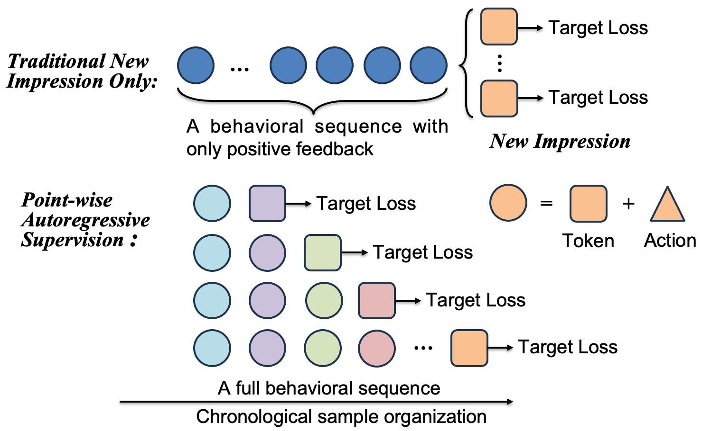
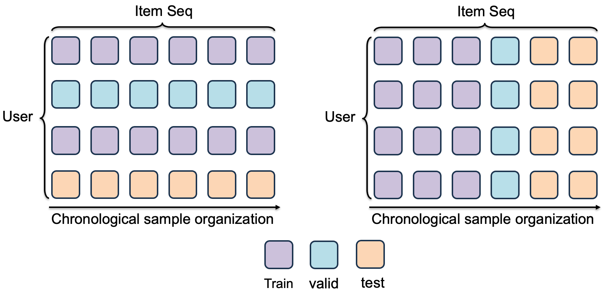
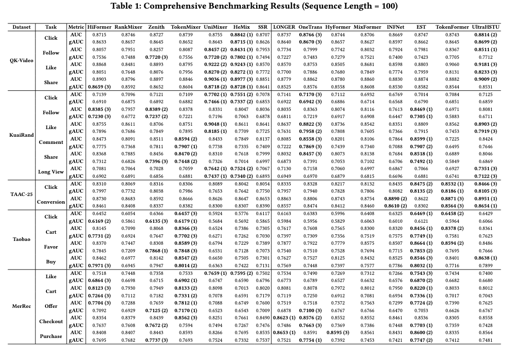

# UniRank <sub>v0.1.0, work in progress</sub>

**A Ranking Model Benchmark for Unified Sequential Modeling and Feature Interaction**

UniRank is an open PyTorch benchmark for studying large-scale recommendation ranking models under one reproducible pipeline. It focuses on a practical industrial setting in which a ranker must jointly use user profiles, item attributes, context fields, long behavior histories, and multiple feedback labels such as click, follow, like, cart, long-view, and conversion.

Instead of treating data preparation, sequential modeling, feature interaction, and distributed training as unrelated components, UniRank standardizes them as one end-to-end framework. The repository currently provides five dataset configurations, fifteen unified ranking model implementations, action-aware sequence construction, blocked Parquet loading, multi-task evaluation, DDP training, mixed precision, and activation checkpointing.

## At a Glance

| Component | Current Support |
|:--|:--|
| Datasets | QK-Video, KuaiRand, TencentGR-10M/TAAC2025, Taobao, MerRec |
| Registered models | 15 unified ranking architectures |
| Learning objectives | Multiple binary feedback tasks with independent task heads and losses |
| Metrics | Logloss, AUC, and user-grouped gAUC for every task |
| Sequence representation | Chronological item, action, and timestamp histories with target-aware truncation |
| Data scale | Blocked Parquet datasets with block-local side information and per-rank load balancing |
| Training | Single GPU or `torchrun` DDP, `torch.compile`, dense/sparse optimizers, bf16, gradient accumulation |
| Memory optimization | Optional non-reentrant activation checkpointing; enabled by default only for Ultra configs |

## Why UniRank?

Modern ranking research is moving from isolated sequence pooling and feature-cross modules toward unified architectures that allow behavioral tokens, target items, and non-sequential fields to interact in a shared representation space. Comparing these models is difficult because published systems often use different datasets, split rules, sequence definitions, label semantics, and training infrastructure.

UniRank is designed to make the following questions measurable under a common protocol:

- Which architecture performs best when the data split, features, sequence length, tasks, and metrics are fixed?
- Should sequence modeling happen before feature interaction, or should both happen layer by layer?
- How do model conclusions change across click, engagement, cart, and conversion objectives?
- How do model size, token dimension, and history length affect accuracy, memory, and throughput?
- Which systems techniques are required to train unified rankers on datasets that do not fit in host memory?

The goal is not to hide dataset-specific semantics. UniRank makes those choices explicit in preprocessing scripts and YAML configurations so that a result can be traced from raw events to labels, history tokens, model inputs, and final metrics.

## Training Paradigm

UniRank replaces the commonly used **newest-impression supervision** paradigm with **point-wise autoregressive supervision**. The difference is not the prediction loss itself—both can use point-wise binary objectives—but how a user sequence is converted into supervised targets.

<p align="center">
  
</p>

**Figure 1. Newest-impression supervision versus point-wise autoregressive supervision.** The upper pipeline produces supervision only for the newest target after a behavioral sequence. The lower pipeline turns successive chronological positions into targets and conditions each prediction on its preceding prefix.

| Aspect | Newest-impression supervision | UniRank point-wise autoregressive supervision |
|:--|:--|:--|
| Target construction | Select the latest impression as the supervised target for a user sequence or training window. | Treat every eligible impression or interaction anchor at position `t` as an individual supervised target. |
| Historical context | Earlier behaviors are used only as context for the final target and are commonly restricted to positive feedback. | The chronological prefix before each target is represented by item, action, and timestamp histories, preserving exposure and multi-feedback information defined by the dataset. |
| Supervision density | A sequence normally contributes one target loss. | A sequence can contribute multiple target losses at different chronological positions. |
| Sequence coverage | Intermediate impressions affect training only when they are retained as history. | Intermediate targets are learned directly and later become historical context for subsequent targets. |
| History length | Training is concentrated around the history available for the newest target. | The model is trained across short, medium, and long prefixes generated by different target positions. |

For a target at position `t`, UniRank predicts its labels from the current target features and the strictly preceding history `H[<t]`. The target itself and all future events are excluded from that history. The dataloader then truncates or pads the prefix to `max_len`:

```text
newest-impression:             loss(y_T, model(H_<T, x_T))
point-wise autoregressive:     sum_t loss(y_t, model(H_<t, x_t))
```

### Why point-wise autoregressive supervision?

- **Denser supervision:** one chronological sequence provides many training targets instead of only its final impression, improving utilization of expensive interaction logs.
- **Direct learning from intermediate decisions:** impressions and feedback at earlier positions contribute their own losses rather than serving only as auxiliary context.
- **Action-aware preference evolution:** an event's multi-feedback action becomes context for later targets, allowing the model to learn how different actions change subsequent ranking outcomes.
- **Coverage across history lengths:** the same framework trains on prefixes of different lengths, reducing dependence on a single fixed newest-impression context.
- **Causal alignment:** every prediction uses only information available before its target time, matching autoregressive sequence modeling without introducing future history tokens.
- **Unified ranking and sequence learning:** target prediction and historical representation are trained from the same chronological sample organization, which is especially useful for models that jointly perform sequence modeling and feature interaction.

This paradigm produces more correlated samples from the same user and can increase training volume, so chronological splitting, user-aware metrics, class imbalance handling, and blocked data loading remain important parts of the benchmark.

### Label and action semantics

UniRank deliberately separates target supervision from history representation:

- **Labels** are stored as independent binary columns. A row may activate multiple tasks, so the configured datasets support multi-hot feedback; for TencentGR, conversion is treated as also implying click.
- **Action** is a categorical history feature. Preprocessors compact a feedback combination into one action ID, with ID `0` reserved for padding/unknown values.
- **Task heads** predict every configured label independently. Loss and AUC/gAUC are therefore reported per task rather than as a single multi-class objective.

This distinction allows a historical event to preserve rich feedback semantics while keeping the current target compatible with standard multi-task binary ranking losses.

## Evaluation Protocol

The sample organization must be paired with an evaluation protocol that preserves time. UniRank therefore uses a **chronological evaluation protocol** rather than treating a user-disjoint split as the only benchmark setting.

<p align="center">
  
</p>

**Figure 2. User-disjoint versus chronological evaluation.** In a user-disjoint split, each user belongs to only one split. In a chronological split, targets are ordered by time: earlier interactions are used for training, a later interval for validation, and the final interval for testing.

| Aspect | User-disjoint protocol | UniRank chronological protocol |
|:--|:--|:--|
| Split unit | Users are assigned exclusively to train, validation, or test. | Samples are assigned by chronological/date boundaries. |
| User overlap | Validation and test users are unseen during training. | A recurring user may appear in multiple splits, but test targets occur after training targets. |
| Primary question | Can the model generalize to entirely unseen users? | Can the model rank future interactions for users under a later data distribution? |
| Historical information | Test users have no training-period model history unless a separate cold-start history policy is defined. | Previously observed interactions can form causal context for later targets according to the preprocessing rules. |
| Online interpretation | Cold-start or new-user recommendation. | Warm-start ranking for recurring users and future traffic. |

### Why chronological evaluation?

- **Matches the deployment direction of time:** the model is trained on the past and evaluated on later interactions instead of mixing future events into the training period.
- **Aligns with point-wise autoregressive supervision:** every validation or test target is evaluated from its preceding prefix under the same causal sample definition used during training.
- **Measures recurring-user ranking:** industrial rankers frequently serve users with existing histories, so retaining users across time boundaries evaluates how models exploit those histories.
- **Exposes temporal distribution shift:** changes in item supply, user intent, context, and feedback rates remain visible between training and test periods.
- **Preserves realistic target histories:** later targets can have histories accumulated before the split boundary, rather than forcing all test users into an artificial no-history condition.

Chronological evaluation is not universally superior to a user-disjoint protocol. It measures warm-start future ranking, whereas user-disjoint evaluation measures cold-start generalization; UniRank's reported results should be interpreted according to the former objective.

During DDP validation and testing, every rank performs inference on its assigned blocks. Predictions, labels, and group IDs are gathered across ranks before metrics are computed, so reported AUC covers the complete split and gAUC groups the complete split by the configured `group_id` (normally `user_index`). Validation selects the monitored checkpoint; testing runs after training with the best checkpoint.

## Framework Workflow

An experiment passes through the following components:

1. **Dataset preprocessing** converts raw events into chronological samples, multi-task labels, full user histories, item side information, metadata, and block manifests.
2. **Dataset configuration** declares paths, feature types, vocabulary sizes, label columns, and blocked-loading options in `config/dataset_config.yaml`.
3. **Feature processing** builds or loads the feature map and assigns sparse embeddings to user, item, context, and action features.
4. **Action-aware loading** reads matching `data`, `user_info`, and `item_info` blocks and constructs target-specific history tensors.
5. **Model interaction** maps fields and histories into model-specific tokens, then applies either stacked unified interaction or layer-wise unified interaction.
6. **Multi-task prediction** produces one probability per label and optimizes the configured binary losses.
7. **Distributed evaluation** aggregates all rank outputs and reports logloss, AUC, and gAUC per task.

The main entry point is `run_expid.py`. Model and dataset selection is configuration-driven, so the same training/evaluation loop can be reused across architectures without model-specific runner scripts.

## Architecture Design

UniRank groups the registered architectures by how unified interaction is organized across the network:

| Paradigm | Description | Models |
|:--|:--|:--|
| Stacked Unified Interaction | Sequence modeling and feature interaction are arranged as consecutive modules. The sequence modeling module first extracts representations from the behavioral history; its output is then combined with user, target-item, and context features and processed by the following feature interaction module. | HiFormer, RankMixer, Zenith, TokenMixer, UniMixer, HeMix, SSR |
| Layer-wise Unified Interaction | Sequence modeling and feature interaction are integrated within each layer. Behavioral sequences and non-sequential features are processed together and updated layer by layer throughout the interaction network. | OneTrans, HyFormer, MixFormer, INFNet, EST, TokenFormer, LONGER, UltraHSTU |

The distinction concerns how sequence modeling and feature interaction modules are organized rather than which operator they use. Stacked models place the two modules in sequence, whereas layer-wise models integrate both operations into each network layer. Transformer attention, target attention, MLP mixers, sparse interaction, and hybrid dense-sequential blocks remain model-specific; input semantics, tasks, splits, and evaluation stay aligned.

## Engineering Optimizations

UniRank includes engineering support for model memory, computation, distributed execution, data access, and multi-task evaluation. These components are shared by the registered models so that architecture comparisons do not require separate training stacks.

### Memory efficiency

- **bf16 mixed precision** runs compatible forward operators under `torch.autocast`, reducing activation storage and Tensor Core compute cost while keeping binary-cross-entropy loss evaluation in FP32 for numerical compatibility.
- **Activation checkpointing** wraps each model's main interaction block with PyTorch non-reentrant checkpointing. Intermediate activations are recomputed during backward instead of being retained for the entire step. The feature is compatible with the current DDP path and is enabled only by Ultra configs by default.
- **Gradient accumulation** decouples the effective batch size from the per-step batch size, allowing large experiments to fit within device memory without changing the optimization batch semantics.
- **CPU evaluation gathering** uses a dedicated Gloo process group for serialized predictions, labels, and group IDs. This avoids transferring large `gather_object` byte tensors through NCCL and prevents evaluation aggregation from creating an unnecessary CUDA-memory peak.

### Training throughput

- **`torch.compile` acceleration** uses the Inductor backend to compile trainable dense child modules while leaving sparse embedding modules outside the compiled region. This keeps the embedding path compatible with sparse optimization and lets supported interaction blocks benefit from graph and kernel optimization. It is controlled by `enable_torch_compile` and is enabled by default in the current framework.
- **Flash Attention through SDPA** is available to models implemented with `torch.nn.functional.scaled_dot_product_attention`. When tensor dtype, shape, mask, and GPU capability satisfy PyTorch's backend constraints, SDPA can dispatch to a fused Flash Attention kernel instead of materializing the full attention matrix. OneTrans, HiFormer, LONGER, Zenith, MixFormer, HeMix, INFNet, EST, and HyFormer contain SDPA-based attention paths.
- **Flex Attention** is used by TokenFormer and UltraHSTU for structured attention patterns that require model-specific masking. `create_block_mask` constructs the block mask and `flex_attention` applies it without replacing the model's masking semantics with a dense generic attention path.
- **Separate dense and sparse optimization** applies AdamW to dense network parameters and Adagrad to embedding parameters with independent learning rates, avoiding a one-size-fits-all optimizer setup for embedding-heavy rankers.
- **Pinned-memory loading** and batched Parquet iteration overlap host-to-device transfer with model execution and avoid materializing the full training split in memory.
- **Distributed data parallelism** uses one CUDA process per GPU and NCCL gradient synchronization. Validation and testing are also partitioned across ranks rather than being repeated entirely on rank 0.

### Blocked data pipeline

Each split can be stored as matching block triplets:

```text
train/
+-- data/part-00000.parquet
+-- user_info/part-00000.parquet
+-- item_info/part-00000.parquet
```

The loader pairs blocks by part ID, streams Parquet batches, keeps a bounded side-information cache, and assigns whole blocks across DDP ranks using estimated sample cost. This avoids loading the complete dataset into host memory and allows preprocessing output to be consumed directly by training. Block-local user/item indices also keep side-information lookup tables bounded by the active block rather than the full dataset cardinality.

### Distributed training and evaluation

`run_expid.py` uses NCCL for DDP tensor communication and a CPU/Gloo process group for large evaluation-object gathering. Each rank trains and evaluates on its assigned data blocks. Dense and sparse parameters can use different optimizers and learning rates, which is useful for embedding-heavy ranking models.

The current runner enables bf16 by default and also exposes it as a command-line parameter for compatible GPUs/models. Gradient accumulation is configured per experiment, while `gradient_checkpointing` recomputes the main interaction block during backward to reduce activation memory. Checkpointing is off in the base configuration and enabled for the largest Ultra variants.

### Engineering benchmark protocol

Memory-saving and training-time claims should be measured under a controlled configuration rather than inferred from tensor dtypes or theoretical operator complexity. For an engineering benchmark, keep the model, dataset blocks, `batch_size`, `max_len`, optimizer, GPU type, GPU count, and number of epochs fixed. Compare one optimization at a time against the same FP32/non-checkpointed/non-compiled baseline.

Use the following definitions:

```text
Memory saving (%) = (baseline peak allocated memory - optimized peak allocated memory)
                    / baseline peak allocated memory * 100

Training time (seconds) = training end timestamp - training start timestamp
```

Peak memory should come from `torch.cuda.max_memory_allocated()` after warm-up. Training time is reported directly in seconds from the beginning of the training loop to the completion of its configured epochs, excluding dataset preprocessing, validation, testing, and checkpoint I/O. For `torch.compile`, lazy graph compilation and first-step kernel selection are included in the training duration so that the chart reflects its actual end-to-end effect rather than only steady-state throughput. Report activation checkpointing, bf16, `torch.compile`, Flash Attention, and Flex Attention separately before reporting combined settings.

Attention benchmarks must keep the attention inputs, masks, precision, sequence length, batch size, and outputs equivalent. For the Flash Attention row, verify that SDPA actually selected a fused Flash backend rather than silently falling back to the memory-efficient or math backend. Flex Attention should be compared with an equivalent implementation of the same structured mask; comparing different masking semantics would not measure an engineering-only speedup.

Enter the matched baseline and optimized measurements in `benchmark/engineering/engineering_benchmark.csv`, then generate both bar charts with:

```bash
python3 benchmark/engineering/plot_engineering_benchmark.py
```

The command writes `assets/figures/engineering_memory_saving.svg` and `assets/figures/engineering_training_time.svg`. The first chart reports peak-memory saving percentages; the second compares baseline and optimized training durations directly in seconds. The CSV template intentionally contains no estimated values: benchmark figures should only be published after measurements from the same model, dataset, hardware, and batch configuration are available.

### Scale variants

RankMixer provides `Small`, `Mid`, `Large`, and `Ultra` configurations on KuaiRand and MerRec. Mid and Large scale the number of non-sequential tokens, sequence length, and token dimension; Ultra extends the Large history length to 1000 and enables activation checkpointing. OneTrans retains the former Small parameters under the standard dataset experiment IDs, such as `OneTrans_KuaiRand_Video_Action` and `OneTrans_MerRec_Action`.

## Repository Structure

```text
UniRank/
+-- config/
|   +-- dataset_config.yaml       # Paths, schemas, labels, vocabularies, blocked loading
|   +-- model_config.yaml         # Experiment IDs, model sizes, optimization and metrics
+-- data/
|   +-- QK_Video/                 # QK-Video preprocessing and statistics
|   +-- KuaiRand/                 # KuaiRand preprocessing and statistics
|   +-- TAAC2025/                 # TencentGR preprocessing, conversion and statistics
|   +-- Taobao/                   # Taobao preprocessing and statistics
|   +-- MerRec/                   # MerRec download, preprocessing and statistics
|   +-- dataset_stats_utils.py
+-- model_zoo/                    # Fifteen registered ranking architectures
+-- unirank/                      # Training, feature, metric and layer utilities
+-- assets/figures/               # README and benchmark figures
+-- benchmark/                    # Accuracy logs and engineering benchmark utilities
+-- checkpoints/                  # Saved model checkpoints
+-- UniRank_Dataloader.py         # Blocked action-aware sequence dataloader
+-- run_expid.py                  # Single-experiment entry point
+-- run_all.sh                    # Batch experiment launcher
+-- run_param_tuner.py            # Hyperparameter tuning entry point
+-- autotuner.py
+-- requirements.txt
+-- README.md
```

## Datasets

| Dataset ID | Feedback tasks | Raw/source data | Preprocessing script |
|:--|:--|:--|:--|
| `QK_Video_Action` | click, follow, like, share | [QK-Video](https://static.qblv.qq.com/qblv/h5/algo-frontend/tenrec_dataset.html) | `data/QK_Video/preprocess_QK_seq_action.py` |
| `KuaiRand_Video_Action` | click, follow, like, comment, forward, long-view | [KuaiRand](https://kuairand.com/) | `data/KuaiRand/preprocess_Kuairand_seq_action.py` |
| `TencentGR_10M_Action` | click, conversion | [TAAC2025/TencentGR-10M](https://huggingface.co/datasets/TAAC2025/TencentGR-10M) | `data/TAAC2025/preprocess_TAAC2025_seq_action.py` |
| `Taobao_Action` | click, cart, favorite, buy | [Taobao Ad Display/Click Data](https://tianchi.aliyun.com/dataset/56) | `data/Taobao/preprocess_Taobao_seq_action.py` |
| `MerRec_Action` | like, cart, offer, checkout, purchase | [Mercari MerRec](https://huggingface.co/datasets/mercari-us/merrec) | `data/MerRec/preprocess_MerRec_seq_action.py` |

Available preprocessed dataset repositories:

- [QK_Video_Action](https://huggingface.co/datasets/salmon1802/QK-Video)
- [KuaiRand_Video_Action](https://huggingface.co/datasets/salmon1802/KuaiRand)
- [TAAC-25](https://huggingface.co/datasets/salmon1802/TAAC-25)
- [Taobao](https://huggingface.co/datasets/salmon1802/Taobao)
- [MerRec](https://huggingface.co/datasets/salmon1802/MerRec)


The output location does not have to be inside this repository. Set the actual Parquet and side-information paths in `config/dataset_config.yaml`. Every dataset directory should contain the generated `meta_data.json`; blocked datasets should also contain `block_manifest.json`.

Each dataset folder includes a statistics script. Use `--help` to inspect its path arguments, for example:

```bash
python3 data/MerRec/stat_MerRec_dataset.py --help
python3 data/TAAC2025/stat_TAAC2025_dataset.py --help
```

## Models

The following implementations are exported by `model_zoo/__init__.py`:

| No. | Model | Reference / Notes |
|:--:|:--|:--|
| 1 | [OneTrans](./model_zoo/OneTrans.py) | [OneTrans: Unified Feature Interaction and Sequence Modeling with One Transformer in Industrial Recommender](https://arxiv.org/abs/2510.26104) |
| 2 | [RankMixer](./model_zoo/RankMixer.py) | [RankMixer: Scaling Up Ranking Models in Industrial Recommenders](https://arxiv.org/abs/2507.15551) |
| 3 | [Zenith](./model_zoo/Zenith.py) | [Zenith: Scaling up Ranking Models for Billion-scale Livestreaming Recommendation](https://arxiv.org/pdf/2601.21285) |
| 4 | [HyFormer](./model_zoo/HyFormer.py) | [HyFormer: Revisiting the Roles of Sequence Modeling and Feature Interaction in CTR Prediction](https://arxiv.org/abs/2601.12681) |
| 5 | [MixFormer](./model_zoo/MixFormer.py) | [MixFormer: Co-Scaling Up Dense and Sequence in Industrial Recommenders](https://arxiv.org/abs/2602.14110) |
| 6 | [TokenMixer](./model_zoo/TokenMixer.py) | [TokenMixer-Large: Scaling Up Large Ranking Models in Industrial Recommenders](https://arxiv.org/pdf/2602.06563) |
| 7 | [HiFormer](./model_zoo/HiFormer.py) | [HiFormer: Heterogeneous Feature Interactions Learning with Transformers for Recommender Systems](https://arxiv.org/pdf/2311.05884) |
| 8 | [INFNet](./model_zoo/INFNet.py) | [INFNet: A Task-aware Information Flow Network for Large-Scale Recommendation Systems](https://arxiv.org/pdf/2508.11565v1) |
| 9 | [EST](./model_zoo/EST.py) | [EST: Towards Efficient Scaling Laws in Click-Through Rate Prediction via Unified Modeling](https://arxiv.org/pdf/2602.10811) |
| 10 | [LONGER](./model_zoo/LONGER.py) | [LONGER: Scaling Up Long Sequence Modeling in Industrial Recommenders](https://arxiv.org/abs/2505.04421) |
| 11 | [HeMix](./model_zoo/HeMix.py) | [Query-Mixed Interest Extraction and Heterogeneous Interaction: A Scalable CTR Model for Industrial Recommender Systems](https://arxiv.org/pdf/2602.09387) |
| 12 | [UniMixer](./model_zoo/UniMixer.py) | [UniMixer: A Unified Architecture for Scaling Laws in Recommendation Systems](https://arxiv.org/pdf/2604.00590) |
| 13 | [TokenFormer](./model_zoo/TokenFormer.py) | [TokenFormer: Unify the Multi-Field and Sequential Recommendation Worlds](https://arxiv.org/abs/2604.13737) |
| 14 | [UltraHSTU](./model_zoo/UltraHSTU.py) | [Bending the Scaling Law Curve in Large-Scale Recommendation Systems](https://arxiv.org/pdf/2602.16986) |
| 15 | [SSR](./model_zoo/SSR.py) | [Beyond Dense Connectivity: Explicit Sparsity for Scalable Recommendation](https://arxiv.org/pdf/2604.08011) |

## Preliminary Benchmark

The following snapshot reports preliminary results with sequence length 100 and three interaction layers. The token dimension is 256 for all datasets. It is retained as an early comparison snapshot; the current registry and YAML configurations continue to evolve.

<p align="center">
  
</p>

**Figure 3. Preliminary benchmark results.** AUC and gAUC are reported for each feedback task. Bold values indicate the strongest results for a task-metric pair within this snapshot. When extending the table, keep preprocessing, split boundaries, sequence length, features, model size, and random seeds fixed.

## Installation

```bash
conda create -n UniRank python=3.9
conda activate UniRank

pip install torch==2.8.0 torchvision==0.23.0 torchaudio==2.8.0 \
  --index-url https://download.pytorch.org/whl/cu126
pip install -r requirements.txt
```

The CUDA build must match the driver and GPUs on the training machine. Long-sequence acceleration paths may require a recent PyTorch/CUDA combination beyond the minimum environment above.

## Quick Start

### 1. Configure a dataset

Download or generate a preprocessed dataset, then update its paths and vocabulary sizes in `config/dataset_config.yaml`. The configured label order must match the task/loss order in the selected model experiment.

To preprocess from raw data, inspect the dataset-specific CLI first:

```bash
python3 data/QK_Video/preprocess_QK_seq_action.py --help
python3 data/KuaiRand/preprocess_Kuairand_seq_action.py --help
python3 data/TAAC2025/preprocess_TAAC2025_seq_action.py --help
python3 data/Taobao/preprocess_Taobao_seq_action.py --help
python3 data/MerRec/preprocess_MerRec_seq_action.py --help
```

### 2. Run one experiment

Single GPU:

```bash
python3 run_expid.py \
  --config ./config \
  --expid RankMixer_KuaiRand_Video_Action_Small \
  --gpu 0
```

Multi-GPU DDP:

```bash
torchrun --standalone --nproc_per_node=4 run_expid.py \
  --config ./config \
  --expid RankMixer_KuaiRand_Video_Action_Small \
  --gpu 0,1,2,3
```

The number of processes must equal the number of GPU IDs. Passing several GPU IDs to plain `python3` does not automatically enable DDP.

To make the current bf16 setting explicit for a compatible GPU/model:

```bash
torchrun --standalone --nproc_per_node=4 run_expid.py \
  --config ./config \
  --expid OneTrans_MerRec_Action \
  --gpu 0,1,2,3 \
  --enable_bf16 True
```

Experiment IDs are defined in `config/model_config.yaml`. Most IDs follow `<Model>_<Dataset>`; scale experiments append `_Small`, `_Mid`, `_Large`, or `_Ultra`.

### 3. Run a batch of experiments

Edit `run_all.sh`, uncomment the required tasks, and run:

```bash
chmod +x run_all.sh
./run_all.sh
```

Checkpoints are written under `model_root` and logs are controlled by the runner/configuration. The best validation checkpoint is used for final test evaluation and then removed by the current experiment runner after testing.

## Configuration Guide

### `dataset_config.yaml`

- `feature_cols`: feature name, type, source, dtype, sequence length, and vocabulary size.
- `label_col`: ordered binary task labels returned to the model.
- `train_data`, `valid_data`, `test_data`: split-specific Parquet paths.
- `*_user_info`, `*_item_info`: side-information paths paired with split data blocks.
- `blocked`, `block_cache_size`: large-data loading and caching behavior.

### `model_config.yaml`

- `model`, `dataset_id`: implementation and dataset binding.
- `num_tasks`, `task`, `loss`: task-head and objective definitions.
- `metrics`, `group_id`, `monitor`: evaluation and checkpoint-selection rules.
- `max_len`, `token_dim`, `num_layers`: history and interaction capacity.
- `dense_optimizer`, `sparse_optimizer`: separate optimization for network and embeddings.
- `batch_size`, `accumulation_steps`: effective batch-size controls.
- `gradient_checkpointing`: activation-memory trade-off during training.
- `enable_torch_compile`: enable or disable Inductor compilation of eligible dense modules.

The `Base` section provides shared defaults; each experiment overrides only the parameters needed by a model/dataset combination.

## Extending UniRank

### Add a model

1. Implement the model in `model_zoo/YourModel.py` using the shared feature map and multi-task interface.
2. Export it from `model_zoo/__init__.py`.
3. Add model/dataset experiments to `config/model_config.yaml`.
4. Reuse `UniRank_Dataloader.py` unless the architecture requires a genuinely different input contract.
5. Add the experiment ID to `run_all.sh` and verify single-GPU and DDP execution.

All current models expose their main interaction block through the shared activation-checkpoint helper, so new large models should do the same when practical.

### Add a dataset

1. Produce chronological `train`, `valid`, and `test` samples with explicit label semantics.
2. Generate matching user histories and item side information for every block.
3. Reserve categorical ID `0` for padding/unknown values and record vocabulary sizes.
4. Write `meta_data.json` and, for blocked output, `block_manifest.json`.
5. Add a dataset entry to `config/dataset_config.yaml` and a statistics script alongside the preprocessor.
6. Add one nearby experiment configuration per model to keep cross-dataset comparisons organized.

## Reproducibility Notes

- Compare models on identical generated dataset files, not only identical raw sources.
- Keep label construction windows and action-token rules fixed across experiments.
- Report both global AUC and user-grouped gAUC; they measure different aggregation behavior.
- Preserve chronological split boundaries when evaluating warm-start future ranking.
- Use several seeds for small reported gains, especially when model differences are below normal run-to-run variation.
- Record model size, sequence length, token dimension, batch size, precision, and GPU count together with accuracy metrics.

## Acknowledgement

UniRank is built on top of, and deeply inspired by, the excellent [FuxiCTR](https://github.com/reczoo/FuxiCTR) project. We sincerely thank the FuxiCTR authors and contributors for their open-source work on reproducible CTR and ranking model research.

## License

This project is released under the [Apache License 2.0](./LICENSE).
